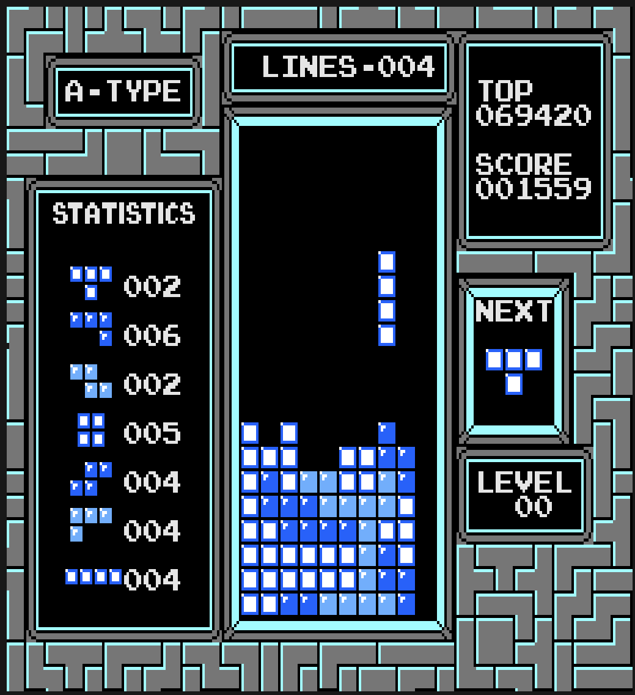

# Tetrizz - Tetris for console

This is a clone of the famous NES-Tetris, that runs entirely in the command line in full resolution.

To achieve this, I've written a whole "graphics engine", that only updates the necessary pixels. This was necessary to achieve the constant 60 FPS, like the original NES console does. This program doesn't require a lot of performance, and can achieve 60 FPS on nearly any device!

<!-- vscode-markdown-toc -->
* [Features](#Features)
* [Requirements](#Requirements)
* [Build](#Build)
* [Controls](#Controls)
* [Roadmap](#Roadmap)
* [Issues and Improvements](#IssuesandImprovements)

<!-- vscode-markdown-toc-config
	numbering=false
	autoSave=false
	/vscode-markdown-toc-config -->
<!-- /vscode-markdown-toc -->

## Features

- Original scoring system
- Controls and speeds (drop speed, etc.) like the original
- Tetromino randomizer like the original
- Same bugs as original (intentionally)

## Requirements

- Linux
- xterm 256 color support in your terminal of choice
  - It should be fast enough for any terminal, but if you experience performance problems, I recommend something like [alacritty](https://github.com/alacritty/alacritty) or [kitty](https://github.com/kovidgoyal/kitty)
- 256 characters in width and 112 characters in height
  - Zooming out in terminals is done with <kbd>Control</kbd> + <kbd>-</kbd> or <kbd>Control</kbd> + <kbd>⇧ Shift</kbd> + <kbd>-</kbd> most of the time

## Build

- Download this repository
- Go into the root directory of this repository
- Create a folder named: `build`
- Run: `make`
- Run: `./build/main.out`

If you want to change your starting level, then you need to modify `src/main.cpp` and change the value in `game.start()` (by default 0).

If you experience compromised visuals, be sure your terminal supports xterm 256 colors, and is zoomed out enough, described in the [requirements](#Requirements).

## Controls

- A: <kbd>x</kbd>
- B: <kbd>y</kbd>
- start: <kbd>⏎ Enter</kbd>
- select: <kbd>⇥ Tab</kbd>
- D-Pad: <kbd>↓</kbd> <kbd>↑</kbd> <kbd>←</kbd> <kbd>→</kbd>

## Roadmap

- Finishing all animations
- Menu screen and end screen
- B-Mode
- (maybe capability for windows, although there are performance issues on the experimental builds for windows)

## Issues and Improvements

Known issues:
- Input sometimes not recognized when holding down on a key:
	- This is due to how each operating system handles keyboard inputs, and unfortunately I couldn't find a fix for this.
- Program exits when game ends:
	- This was initially a school project, and due to a time stress, I just exited the program when the game ended. This is also the reason there isn't any commit history, as I can't modify the original repository and make it public. This will be fixed when I implement the menu screens.

If you experience any other problems or have improvement suggestions, feel free to contact me!
